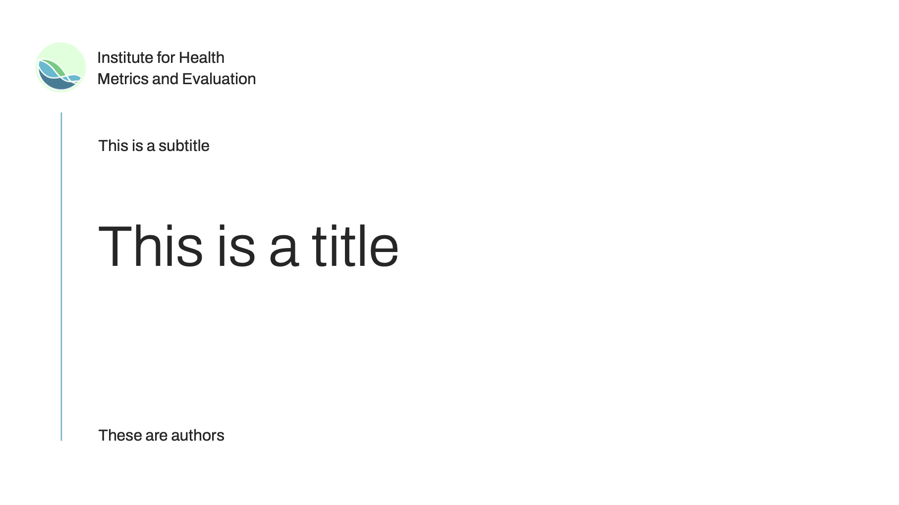
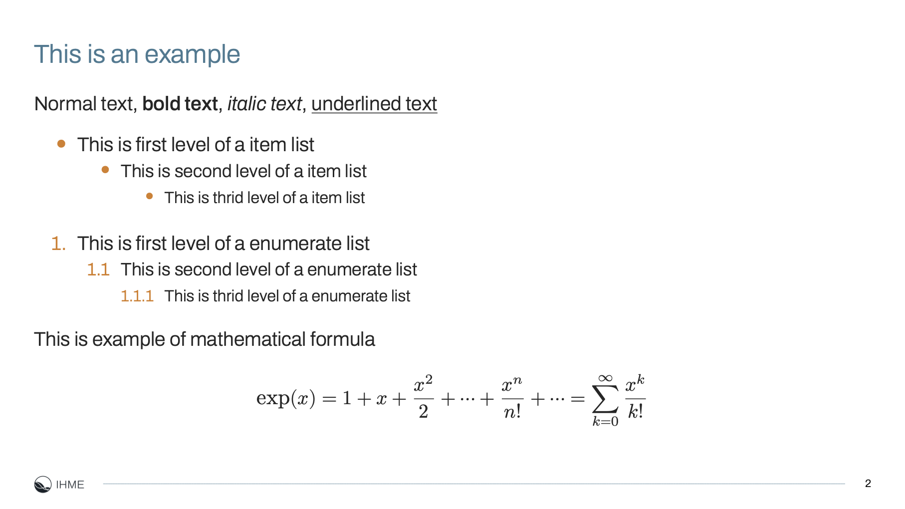
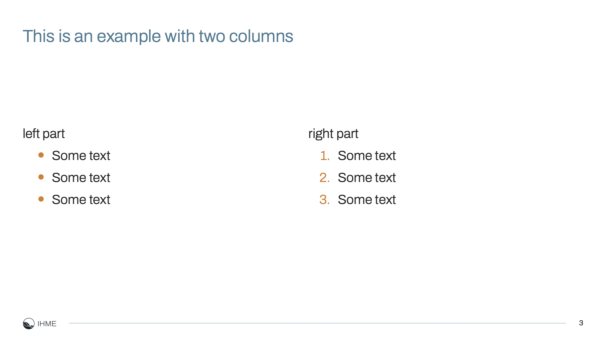

# IHME slides style

This is a LaTeX Beamer replica of the IHME powerpoint template.

To start, you will need to install
[Archivo](https://fonts.google.com/specimen/Archivo) font.
And you can use [example.tex](example.tex) as starting point for your project.

## Resources

### LaTeX IDE
We use VSCode with [laTeX Workshop](https://marketplace.visualstudio.com/items?itemName=James-Yu.latex-workshop) extension.
Since we are using `fontspec` and customized font, we will need to compile with `lualatex` or `xelatex` engine, and
here we prefer `lualatex`. To use `lualatex` in the first line of `.tex` file we add `% !TEX program = lualatex` [magic comment](https://github.com/James-Yu/LaTeX-Workshop/wiki/Compile#magic-comments),
and in the VSCode settings, we need to specify [`"latex-workshop.latex.build.forceRecipeUsage": false`](https://github.com/James-Yu/LaTeX-Workshop/wiki/Compile#latex-workshoplatexbuildforcerecipeusage).

### Install Fonts on a Mac
To install a font on a mac, please download the font files (usually in `.ttf` or `.otf`) and drag them in **Font Book**.
For more details please check [here](https://support.apple.com/guide/font-book/install-and-validate-fonts-fntbk1000/mac#:~:text=In%20the%20Font%20Book%20app,to%20the%20Font%20Book%20window.).

